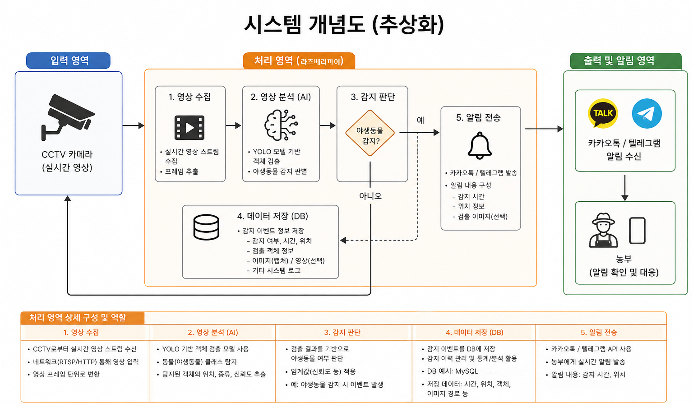
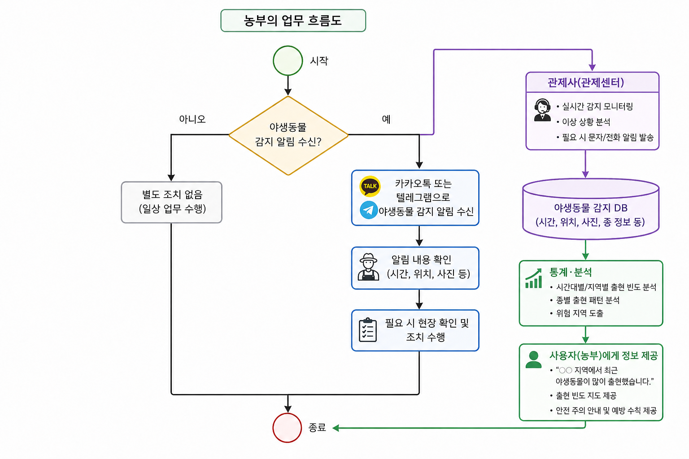

# 🌙 엣지 디바이스 기반 초고속 야간 객체 인식 시스템 (Fast Night Vision AI)

## 📌 프로젝트 개요
본 프로젝트는 조도가 극히 낮은 야간 환경에서도 객체(사람 등)를 실시간으로 정확하게 인식하기 위한 파이프라인을 구축한 캡스톤 디자인입니다. 
무거운 파이토치(PyTorch) 환경을 벗어나 **ONNX 변환 및 최적화**를 통해 엣지 디바이스(Jetson Orin Nano 등)에서도 딜레이 없는 실시간 처리를 목표로 합니다.

## 📊 시스템 개념도 및 업무 흐름
> 프로젝트의 전체적인 구조와 흐름입니다.




## 🚀 핵심 기술 (Core Technologies)
* **Zero-DCE (ONNX):** 딥러닝 기반 저조도 영상 화질 개선 (실시간 처리 최적화)
* **YOLO11 Nano:** 개선된 영상에서 객체를 즉각적으로 바운딩 박스(Bounding Box) 처리
* **OpenCV DNN:** 파이토치 의존성 제거 및 C++ 기반 고속 추론 엔진 활용

## 📁 파일 구성
* `test_ir_yolo.py` : 메인 실행 파이프라인 코드 (스레드 병목 제거 완료)
* `zero_dce_sim.onnx` / `.data` : 다림질(Simplifier) 및 사이즈 고정이 완료된 Zero-DCE 모델
* `yolo11n.pt` : 객체 인식 모델
* `requirements.txt` : 구동에 필요한 파이썬 패키지 목록

## 🛠️ 실행 방법 (How to Run)
1. 본 저장소를 클론(Clone)합니다.
2. 터미널에서 필수 라이브러리를 설치합니다.
   ```bash
   pip install -r requirements.txt
